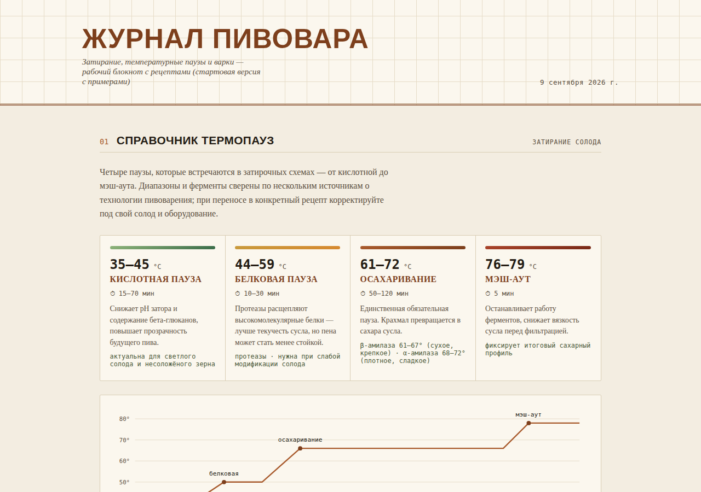
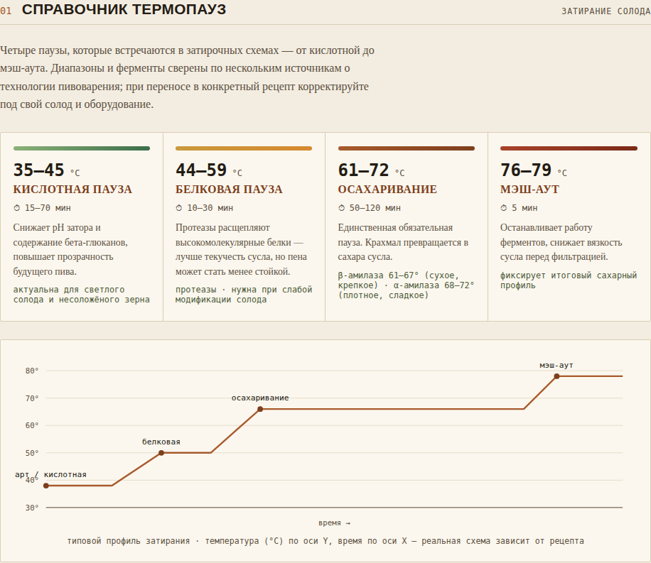
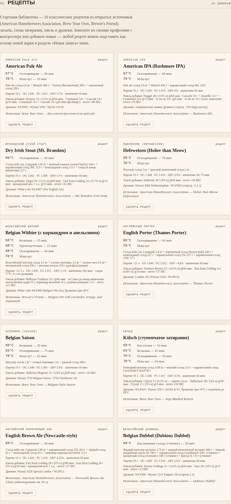
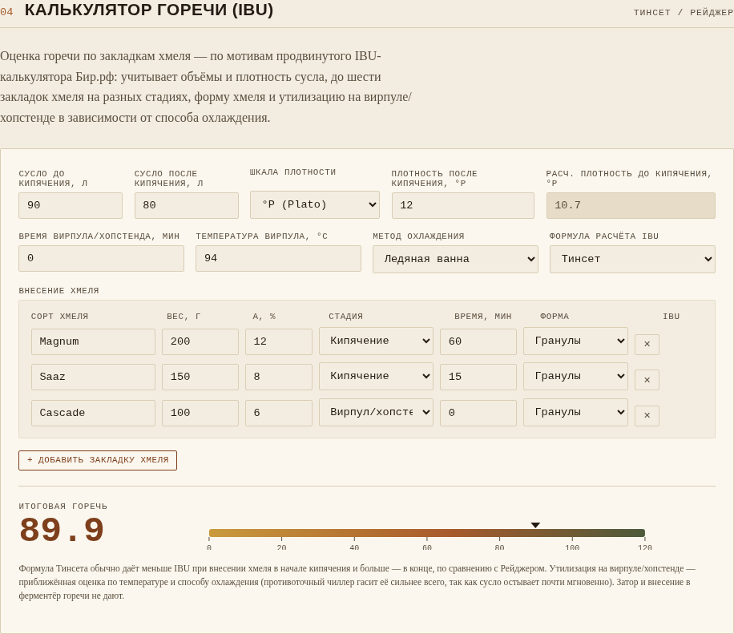
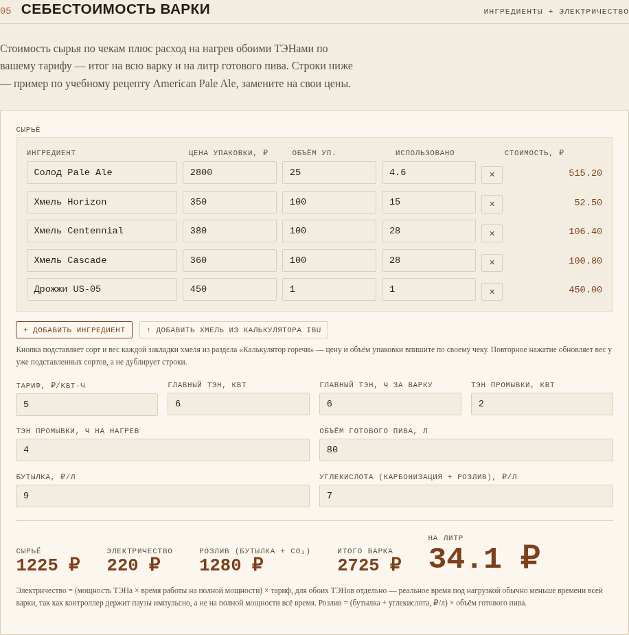

# Журнал пивовара

Веб-блокнот для домашнего пивовара: справочник температурных пауз затирания, библиотека рецептов, журнал фактических варок, калькулятор горечи (IBU) и калькулятор себестоимости варки. Всё это — один HTML-файл (`zhurnal-pivovara.html`), никаких сборок и зависимостей на клиенте.

Сделано для тех, у кого есть автоматический контроллер затирания (например, самодельный или готовый на базе ESP/Arduino, тип «Distiller» и подобные) и кто хочет вести варки и рецепты рядом с ним, а не в отдельном приложении.

## Что внутри

- **Справочник термопауз** — кислотная, белковая, осахаривание, мэш-аут: диапазоны температур, длительность, что каждая пауза делает с суслом.
- **Библиотека рецептов** — 10 стартовых рецептов из открытых источников (American Homebrewers Association, Brew Your Own, Brewer's Friend — ссылка на источник есть в каждой карточке). Замените их своими профилями с контроллера или добавьте новые прямо в браузере.
- **Журнал варок** — форма добавления фактической варки: OG/FG/ABV, вода, схема затирания, засыпь и хмель, заметки. Плотность можно вписывать как SG или в Brix/Plato — журнал сам разберёт и посчитает.
- **Калькулятор IBU** — до шести закладок хмеля, стадии внесения (затор / первое сусло / кипячение / вирпул-хопстенд / ферментёр), учёт формы хмеля и утилизации на вирпуле в зависимости от способа охлаждения. Формулы Тинсета и Рейджера на выбор.
- **Калькулятор себестоимости** — сырьё по чекам + расход электричества по обоим ТЭНам + розлив, итог на всю варку и на литр. Кнопка «добавить хмель из калькулятора IBU» переносит сорта и вес хмеля прямо в список сырья, без повторного ввода.

Рецепт или варку можно подставить как основу новой записи одной кнопкой — журнал сам заполнит засыпь, воду, хмель, дрожжи и схему затирания.

## Цифровой ареометр RAPT Pill

Если у вас есть [RAPT Pill](https://kegland.com.au) (или другой ареометр KegLand RAPT), подключённый к вашему аккаунту на `app.rapt.io`, журнал умеет забирать его показания напрямую — без ручного переноса цифр:

- При добавлении варки — чекбокс «Использовать RAPT Pill для этой варки» и выбор конкретного ареометра (по имени, как он называется в вашем аккаунте RAPT).
- Кнопки «подставить OG» / «подставить FG» — берут текущую плотность с ареометра прямо в форму.
- На карточке варки, пока брожение активно — живая панель: текущая плотность, температура, заряд батареи и график изменения плотности/температуры за последнюю неделю.
- Кнопка **«Брожение завершено»** останавливает опрос RAPT для этой варки (карточка перестаёт дёргать API RAPT при каждом открытии страницы), запоминает последнее показание и, если FG ещё не вписан вручную, сама подставляет его из последней плотности.

Работает только при развёрнутом PHP-бэкенде (см. раздел ниже) — само облако RAPT нельзя опрашивать прямо из браузера (нет нужных CORS-заголовков, и незачем светить учётные данные в клиентском коде), поэтому опрос идёт через ваш `api.php`.

Требования сервера: в `api.php` RAPT-функции ходят в облако RAPT через **PHP-расширение `curl`** — без него запросы к RAPT падают с ошибкой `Call to undefined function curl_init()`, хотя сам журнал продолжает работать. На Synology curl обычно не включён по умолчанию.

Настройка:

1. Скопируйте `config.local.example.php` в `config.local.php` (рядом с `api.php` на сервере) и впишите email от аккаунта `app.rapt.io` и API-секрет (не пароль от аккаунта, а отдельный секрет — генерируется в настройках аккаунта на `app.rapt.io`, раздел, отвечающий за интеграции/API).
2. `config.local.php` никогда не коммитьте — он уже в `.gitignore`.
3. Если файла нет или он не заполнен — RAPT-блок в журнале просто скрыт, остальной журнал работает как обычно.
4. **На Synology включите расширение `curl`**: Package Center → Web Station (или сам пакет PHP 8.x/7.x) → PHP Settings/Profile → выберите используемый профиль → вкладка Extensions → поставьте галочку у `curl` → сохраните. Web Station обычно сам перезапускает php-fpm; если список ареометров всё равно не подгружается — перезапустите Web Station вручную и обновите страницу журнала.

## Как это хранит данные

Журнал не требует сервера — можно просто открыть `zhurnal-pivovara.html` как файл, всё будет храниться в `localStorage` браузера (то есть только на этом устройстве и в этом браузере).

Если нужно, чтобы одни и те же варки были видны с разных устройств в сети (телефон, ноутбук, ПК на кухне рядом с котлом), есть три варианта:

1. **Свой сервер с PHP** — самый простой вариант (описан ниже, включая Synology).
2. **Как страница внутри Claude** — если вы открываете журнал как Артефакт Claude, он сам предложит сохранять новые записи в облако Claude.
3. **Только localStorage** — если ничего из этого не настроено, журнал молча остаётся в режиме «только этот браузер».

Журнал сам определяет, какой вариант доступен, и показывает это в подвале страницы.

### Вариант с PHP-бэкендом (в том числе на Synology)

1. Положите `zhurnal-pivovara.html` и `api.php` рядом, в одну папку на любом веб-сервере с PHP (Synology Web Station, Apache, nginx+php-fpm — не важно).
2. Рядом с `api.php` должна быть доступная для записи папка `data/` — в неё бэкенд пишет `journal-data.json` со всеми рецептами и варками. В репозитории уже лежит пустая папка `data/` с `.gitkeep`; создайте её на сервере и дайте веб-серверу права на запись, если её нет.
3. Откройте `zhurnal-pivovara.html` через веб-сервер (не как локальный файл) — журнал сам найдёт `api.php` в той же папке и начнёт читать/писать через него. Все, у кого есть доступ к этому адресу в сети, увидят одни и те же записи.
4. `journal-data.example.json` показывает формат файла, который создаст `api.php` — на случай, если нужно перенести данные вручную или сделать бэкап.

Для Synology конкретно: File Station → загрузите оба файла в `web/` (общая папка Web Station), создайте там же подпапку `data`. Дальше страница открывается по адресу вашего NAS, например `http://<IP-адрес-NAS>/zhurnal-pivovara.html`.

## Структура репозитория

```
zhurnal-pivovara.html       — сам журнал, единственный файл, нужный в браузере
api.php                     — необязательный общий бэкенд (общее хранилище по сети + прокси к RAPT)
config.local.example.php    — шаблон настроек доступа к RAPT Pill (скопировать в config.local.php)
journal-data.example.json   — пример формата данных, которые хранит api.php
data/                       — пустая папка-заглушка; на сервере сюда пишется journal-data.json
```

## Настройка под себя

- **Рецепты контроллера.** В файле есть функция `controllerSteps()` и массив `seedRecipes` (сейчас пустой) — именно туда добавляются профили с вашего контроллера затирания, в том же формате, что и у стартовых рецептов из открытых источников.
- **Себестоимость.** Раздел «Себестоимость варки» ничего не знает о ваших ценах — впишите свои значения по тарифу на электричество и ценам на сырьё, они останутся только у вас (в `localStorage` или в вашем `journal-data.json`, если настроен бэкенд).
- **Цвета и шрифты** — все в одном блоке `<style>` в начале файла, через CSS-переменные (`--copper`, `--malt`, `--hop` и т.д.), включая отдельную палитру для тёмной темы.

## Лицензия и источники

Код журнала — MIT (см. `LICENSE`). Десять стартовых рецептов в библиотеке взяты из открытых публикаций American Homebrewers Association, Brew Your Own и Brewer's Friend — ссылка на источник указана в каждой карточке рецепта; авторские права на сами рецепты принадлежат их публикаторам.

Этот репозиторий не содержит личных рецептов, реальных варок или данных конкретного пивовара — только пустые заготовки и примеры для демонстрации.

## Скриншоты






